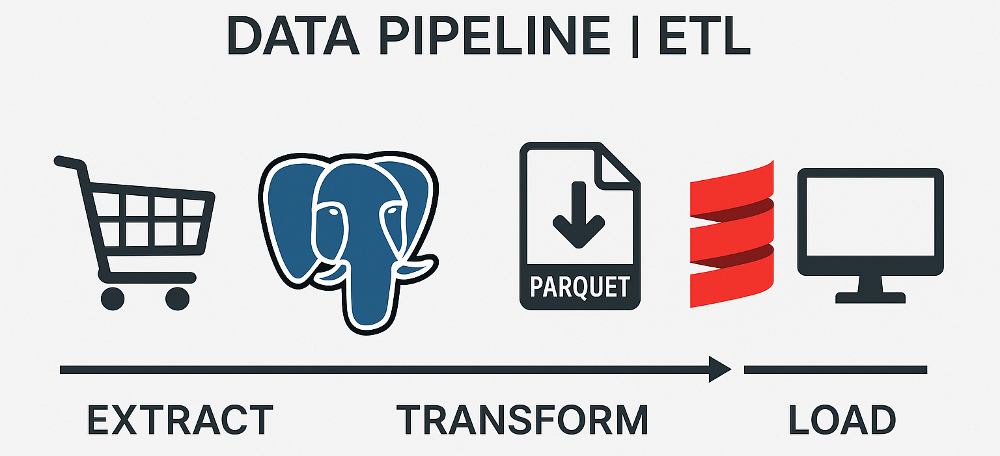
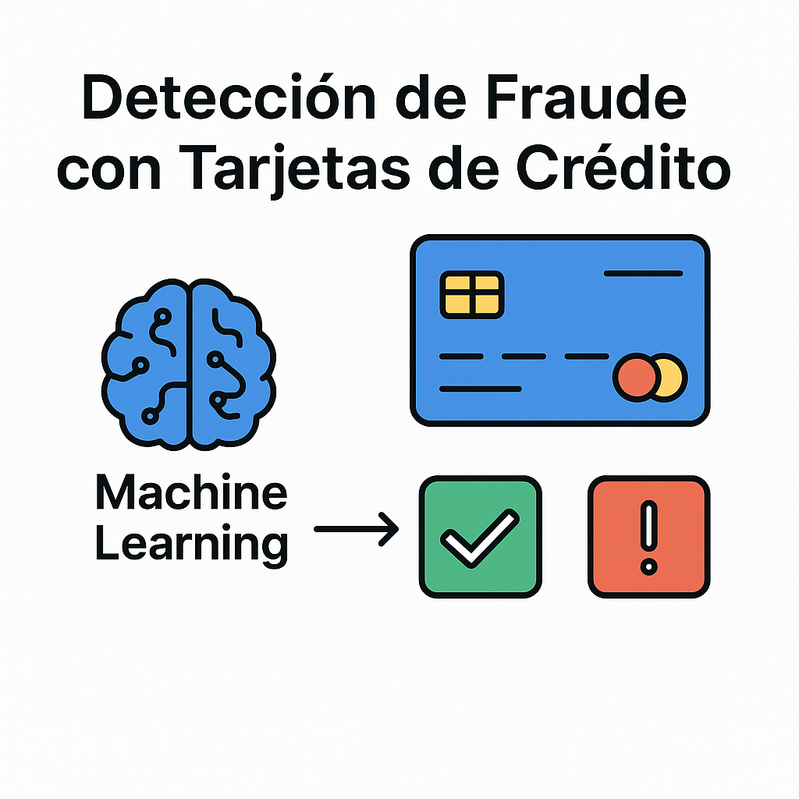

# 👨‍💻 Eduardo Ortega — Data Scientist
Transformo datos en soluciones inteligentes con Python y Machine Learning.

---

## 🚀 Sobre mí

Soy un Data Scientist apasionado por convertir datos en decisiones estratégicas.  
He construido modelos de clasificación, análisis de clientes y chatbots con Python, SQL y machine learning,  
desplegándolos en la nube para soluciones interactivas. Me especializo en modelos eficientes, visualizaciones claras y apps funcionales.

---

## 🧠 Habilidades Técnicas

### Lenguajes
- Python (avanzado), SQL (intermedio), Bash (intermedio)

### Machine Learning
- Scikit-learn, XGBoost, LightGBM, CatBoost  
- Modelos: Regresión logística, Árboles de decisión, Random Forest, K-Means

### Visualización
- Matplotlib, Seaborn, Plotly

### Procesamiento de Lenguaje Natural (NLP)
- SpaCy, NLTK, TF-IDF

### Despliegue y Nube
- FastAPI, Streamlit, Docker, AWS Lambda, Render, Azure

### Bases de Datos
- PostgreSQL, MySQL

### Herramientas
- Git, Jupyter, Google Colab, VS Code, Anaconda

---

## 📂 Proyectos Destacados

### ⚙️ Data Pipeline | ETL

Pipeline para cargar, transformar y dispersar un dataset de compras usando PostgreSQL, Python y Docker.

**Qué hice**  
- Levanté una base de datos con Docker/PostgreSQL  
- Limpié y cargué datos con `load_data.py`  
- Extraje datos a Parquet con `extract_data.py`  
- Transformé datos para crear tablas limpias (`transform_data.py`)  
- Creé y cargué tablas finales (`disperse_data.py`)  
- Implementé una app en Scala para identificar números del 1 al 100

**Tecnologías**  
Python, Pandas, PostgreSQL, Docker, Scala

🔗 [Repositorio en GitHub](https://github.com/Eduardo56745/Data_Pipeline_ETL)

---

### 🔍 Detección de Fraude con Tarjetas de Crédito

Modelo de clasificación para identificar transacciones fraudulentas en datos desbalanceados, desplegado con Streamlit.

**Resultados clave**  
| Métrica     | Valor |
|-------------|-------|
| F1-score    | 0.83  |
| ROC AUC     | 0.99  |

**Tecnologías**  
Python, Pandas, Scikit-learn, LightGBM, Streamlit, Render

🔗 [Prueba la app](https://creditfraud-a5gxdfbwa8ghafeh.canadacentral-01.azurewebsites.net)  
🔗 [Repositorio en GitHub](https://github.com/Eduardo56745/credit_card_fraud_ML)

---

### 🎬 Clasificador de Críticas de Películas (Film Junky AI)

Clasificador de reseñas de películas (positivas o negativas) usando NLP, desplegado como app web.

**Resultados clave**  
| Métrica     | Valor |
|-------------|-------|
| F1-score    | 0.88  |
| ROC AUC     | 0.95  |

**Tecnologías**  
Python, Pandas, Scikit-learn, NLTK, SpaCy, Streamlit, Render

🔗 [Prueba la app](https://clasificadordecriticas-gudzcnc5hxdueuh9.canadacentral-01.azurewebsites.net)  
🔗 [Repositorio en GitHub](https://github.com/Eduardo56745/Film_Junky_AI_Clasificador_de_Criticas)

---

### 🛒 Análisis de Compras de Clientes (Instacart)

Análisis de datos de compras para encontrar patrones y comportamiento del usuario.

**Objetivos**  
- Promedio de artículos por pedido  
- Frecuencia de reordenamientos  
- Porcentaje de productos repetidos  
- Comportamientos de compra

**Tecnologías**  
Python, Pandas, NumPy

🔗 [Repositorio en GitHub](https://github.com/Eduardo56745/Instacart-Data-Analysis)

---

## 🌟 Lo que me diferencia

- Experiencia en **despliegue de modelos** en la nube (Azure, Render)
- Proyectos completos desde recolección hasta visualización y despliegue
- Capacidad para explicar modelos técnicos a públicos no técnicos
- Enfoque autodidacta y aprendizaje continuo

---

## 📚 Educación

- 🎓 **Ingeniería en Sistemas Computacionales** — Universidad Virtual del Estado de Guanajuato *(en curso)*  
- 📊 **Certificación: Data Scientist** — TripleTen

---

## 📎 Contacto

📧 lalox1697@gmail.com  
💼 [LinkedIn](https://www.linkedin.com/in/eduardo-ortega-30154629a/)  
📂 [CV en Google Drive](https://drive.google.com/file/d/1By1Y01hmr3DnA2UzcXPWbjPoqvpEkfKn/view?usp=sharing)  
🌐 [GitHub](https://github.com/Eduardo56745)

---

**Gracias por visitar mi perfil. ¡Estoy listo para aportar valor como Data Scientist! 🚀**
