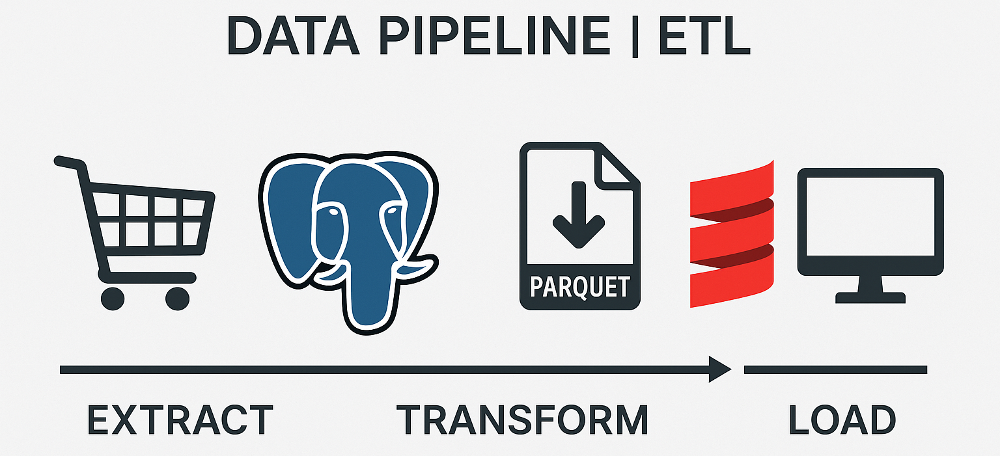
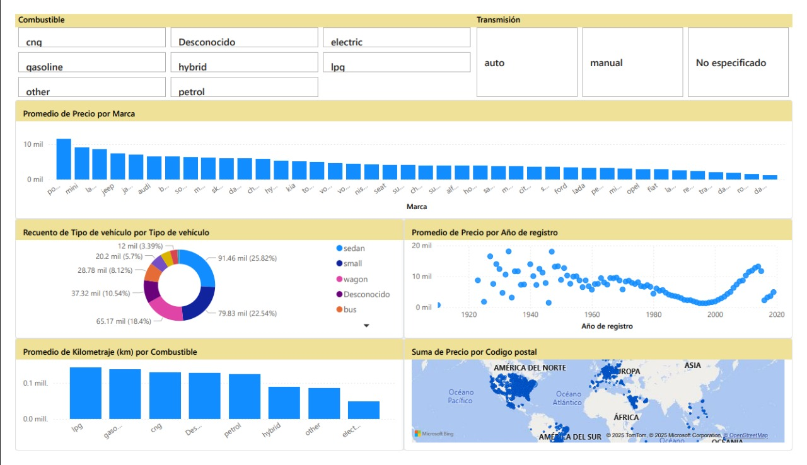

# Eduardo Ortega Torres
### Data Scientist · Python · Machine Learning · Cloud

📍 Guanajuato, México &nbsp;|&nbsp; 📧 lalox1697@gmail.com &nbsp;|&nbsp; [LinkedIn](https://www.linkedin.com/in/eduardo-ortega-30154629a/) &nbsp;|&nbsp; [GitHub](https://github.com/Eduardo56745)

---

## Sobre mí

Estudiante de Ingeniería en Sistemas Computacionales con especialización en Ciencia de Datos. Construyo modelos de Machine Learning y los llevo a producción: desde la limpieza de datos hasta el despliegue en la nube. Me interesa resolver problemas reales con datos, no solo entrenar modelos.

---

## Stack Técnico

| Área | Herramientas |
|---|---|
| **Lenguajes** | Python · SQL · Bash |
| **Machine Learning** | Scikit-learn · LightGBM · XGBoost · CatBoost |
| **NLP** | SpaCy · NLTK · TF-IDF |
| **Visualización** | Matplotlib · Seaborn · Plotly · Power BI |
| **Despliegue & Cloud** | FastAPI · Streamlit · Docker · Azure · GCP · Render |
| **Bases de datos** | PostgreSQL · MySQL |
| **Herramientas** | Git · Jupyter · VS Code · Anaconda |

---

## Proyectos

### Detección de Fraude con Tarjetas de Crédito

Modelo de clasificación para identificar transacciones fraudulentas en datos fuertemente desbalanceados.

| Métrica | Valor |
|---|---|
| F1-score | 0.83 |
| ROC AUC | 0.99 |

Tecnologías: Python · Scikit-learn · LightGBM · Streamlit · Azure

[Ver app](https://creditfraud-a5gxdfbwa8ghafeh.canadacentral-01.azurewebsites.net) &nbsp;·&nbsp; [Repositorio](https://github.com/Eduardo56745/credit_card_fraud_ML)

---

### Film Junky AI — Clasificador de Reseñas

Clasificador de críticas de películas (positiva/negativa) usando NLP, desplegado como app web interactiva.

| Métrica | Valor |
|---|---|
| F1-score | 0.88 |
| ROC AUC | 0.95 |

Tecnologías: Python · NLTK · SpaCy · Scikit-learn · Streamlit · Azure

[Ver app](https://clasificadordecriticas-gudzcnc5hxdueuh9.canadacentral-01.azurewebsites.net) &nbsp;·&nbsp; [Repositorio](https://github.com/Eduardo56745/Film_Junky_AI_Clasificador_de_Criticas)

---

### ChatPDF AI — Asistente con NLP

Backend en Python para procesamiento de documentos PDF con búsqueda semántica y conexión vía API REST.

Tecnologías: Python · NLP · FastAPI · Cloud

[Repositorio](https://github.com/Eduardo56745/chatbot_ds)

---

### Pipeline ETL con Docker

Arquitectura de pipeline completo: carga, transformación y dispersión de datos usando PostgreSQL y Docker.

Tecnologías: Python · Pandas · PostgreSQL · Docker

[Repositorio](https://github.com/Eduardo56745/Data_Pipeline_ETL)

---

### Dashboard de Autos Usados — Power BI

Dashboard interactivo con más de 350,000 registros. Análisis de precios, marcas, tipos de vehículo y tendencias de mercado.

Tecnologías: Power BI · Power Query · DAX

[Repositorio](https://github.com/Eduardo56745/power_bi_car_data)

---

## Formación

**Ingeniería en Sistemas Computacionales** — Universidad Virtual del Estado de Guanajuato *(en curso)*

**Data Scientist** — TripleTen *(2024 – 2025)*

**Google Cloud Computing Foundations** — Google Cloud *(2023)*
